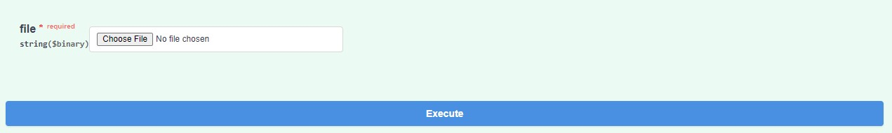
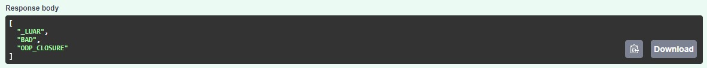
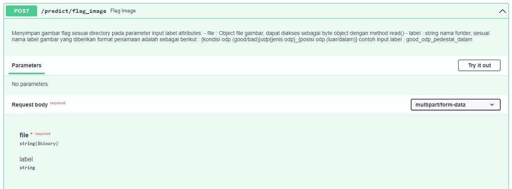
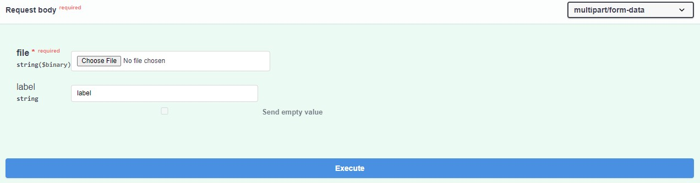
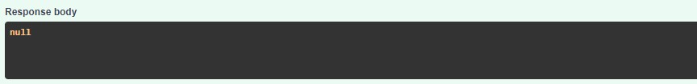
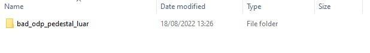

# ML-API-ODP

## Instalasi Dependency
Agar code dapat berjalan di perlukan beberapa dependecy, dapat langsung menjalankan command di terminal berikut satu demi satu jika python dan pip sudah terinstall
```bash
pip install fastapi
pip install uvicorn
pip install pillow
pip install numpy
pip install tensorflow
```

## Menjalankan API
untuk menjalankan API cukup mejalankan command berikut di terminal
```bash
uvicorn main:app --reload
```
secara default dia akan jalan secara lokal di 127.0.0.1 dengan port 8000 Output jika runnning berhasil


## Mencoba Prediksi Image FastAPI
Tampilan Awal FastAPI


1. [/api/predict](#predict-image)
2. [/predict/flag_image](#flag-image)

## predict-image
untuk mencoba prediksi image mengklik button **Try it out**


input file image yang ingin di prediksi dengan format .jpg, .png, .jpeg. lalu klik **execute**



hasil prediksi akan terlihat pada kolom **Response Body**



## flag-image
untuk menginput gambar ke dalam folder flag dengan input label mengklik button **Try it out**



input file image yang ingin di masukan ke dalam folder flag dengan format .jpg, .png, .jpeg. kemudian isi label dengan keterangan jenis dan tipe odp, seperti contoh "good_odp_pedestal_dalam" lalu klik **execute**



hasil input akan terlihat pada kolom **Response Body** bernilai **null** yang gambar nya sudah secara otomatis ada di folder flag



