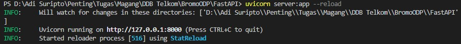
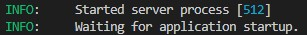
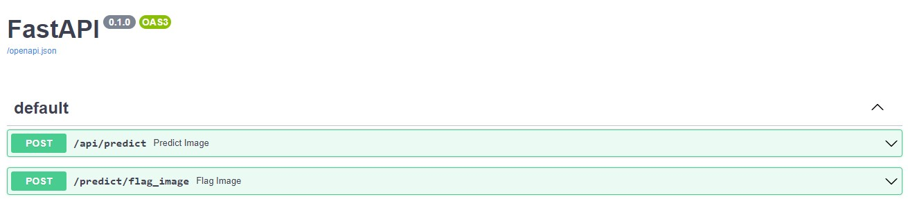
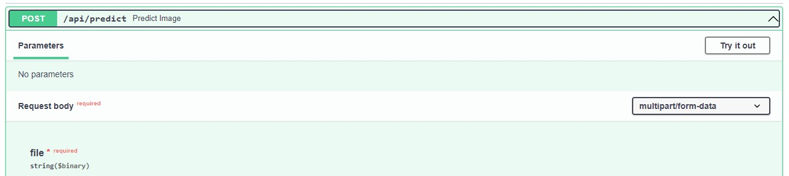

# ML-API-ODP

## Instalasi Dependency
Agar code dapat berjalan di perlukan beberapa dependecy, dapat langsung menjalankan command di terminal berikut satu demi satu jika python dan pip sudah terinstall
```bash
pip install fastapi
pip install uvicorn
pip install pillow
pip install numpy
pip install tensorflow
```

## Menjalankan API
untuk menjalankan API cukup mejalankan command berikut di terminal
```bash
uvicorn main:app --reload
```
secara default dia akan jalan secara lokal di 127.0.0.1 dengan port 8000 Output jika runnning berhasil




## Mencoba Prediksi Image FastAPI
Tampilan Awal FastAPI



1. [/api/predict](##predict-image)
2. [/predict/flag_image](##flag-image)

##predict-image
untuk mencoba prediksi image mengklik button **Try it out**



